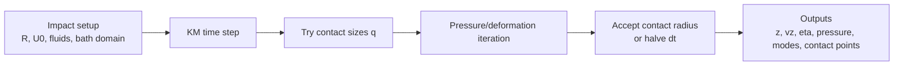
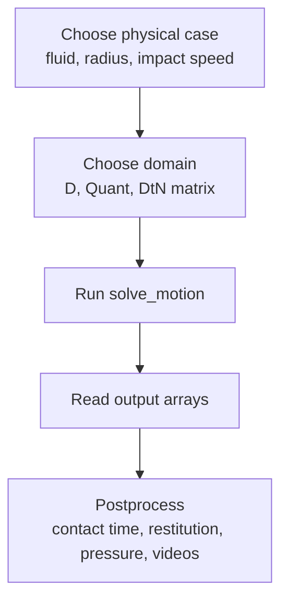

# Droplet rebounds off a fluid bath at low Weber numbers

[](https://doi.org/10.1017/jfm.2026.11291)
[](https://arxiv.org/abs/2509.22826)

This repository contains the simulation code and supporting data for the kinematic-match (KM) model introduced in:

> E. A. Aguero, C. A. Galeano-Rios, C. Ragazzo, C. T. Gabbard, D. M. Harris, and P. A. Milewski, "Droplet rebounds off a fluid bath at low Weber numbers," Journal of Fluid Mechanics 1031, A6 (2026).

The code simulates non-coalescing, axisymmetric impacts of droplets on deep liquid baths in the low-Weber-number regime. The model treats both the droplet and the bath as deformable, predicts the evolving pressed/contact area, pressure distribution, bath wave field, and droplet motion, and was used to compare against experiments and previous simulations.


## What problem does this code solve?

A small droplet can bounce from a liquid bath without coalescing if a thin gas layer persists during impact. The KM model used here does not resolve that gas film directly. Instead, it replaces the film by an idealized pressure-transmitting contact region and enforces the geometric and kinematic constraints that the two liquid interfaces must satisfy while they remain separated.

The published model extends earlier KM work that treated the impactor as rigid. Here, the droplet surface is represented spectrally with Legendre modes, while the bath is represented on a radial mesh and coupled to a Dirichlet-to-Neumann (DtN) operator. This lets the solver resolve droplet deformation, bath deformation, pressure localization, and the moving contact boundary.



## Repository map

```text
km-droplet-onto-bath/
├── README.md                         # This file
├── matlab/
│   ├── 0_data/                       # figures, logs, external/reference data
│   └── 1_code/
│       ├── simulation_code/          # original MATLAB solver and helpers
│       ├── D*/                       # domain templates and cached DtN matrices
│       ├── sweeper_water_2024.m      # water sweep driver
│       ├── sweeper_oil_2024.m        # oil sweep driver
│       └── Figures/                  # paper/postprocessing plotting scripts
└── julia/
    ├── src/                          # standalone Julia port
    ├── data/case_d5q20.jld2          # bundled small case file
    ├── scripts/                      # case building, precompile, sweep helpers
    └── tests/                        # parity/regression checks
```

Use the MATLAB code if you want the original paper workflow and full historical folder tree. Use the Julia code if you want a standalone, easier-to-script solver that does not call MATLAB at runtime.

## Requirements

- MATLAB for the original solver and paper-era sweep/postprocessing scripts.
- Julia 1.10+ for the standalone Julia port.
- Disk space for cached operators and simulation outputs; DtN matrices and field histories can be large.
- Optional Python tooling only for older helper scripts such as email notifications.

## Core workflow



All physical inputs use CGS units unless explicitly stated otherwise: centimeters, grams, seconds.

## MATLAB workflow

The MATLAB solver stores inputs and outputs in a parameter-encoded folder tree. The path is part of the simulation metadata.

```text
D{D}Quant{Quant}/
  rho{...}sigma{...}nu{...}muair{...}/
    RhoS{...}SigmaS{...}/
      R0{####}mm/
        ImpDefCornerAng{Ang}U{U0}/
          N={N}tol={tol}/
```

Example leaf folder:

```text
D5Quant20/.../R0350mm/ImpDefCornerAng180U10/N=10tol=1.00e-02/
```

### Run a sweep

1. Start MATLAB.
2. Change directory to `matlab/1_code`.
3. Open one of the sweep drivers:
   - `sweeper_water_2024.m`
   - `sweeper_oil_2024.m`
4. Edit the parameter lists near the top of the file.
5. Run the script.

The sweeper creates missing folders, prepares required `.mat` inputs, calls `simulation_code/solve_motion.m`, and writes results in each run folder. Re-running a sweep can skip existing results or force recomputation depending on the script settings.

### Run one MATLAB case manually

After creating the folder tree and required `.mat` inputs, move into the leaf run folder and call:

```matlab
solve_motion(U0, [], N, tol, pwd, false)
```

For example:

```matlab
solve_motion(10, [], 10, 1e-2, pwd, false)
```

### MATLAB outputs

Each successful run folder typically contains:

| File | Meaning |
|---|---|
| `z.mat`, `vz.mat`, `tvec.mat` | droplet center-of-mass height, velocity, and saved times |
| `etaOri.mat`, `etas.mat` | bath surface elevation at saved times |
| `numl.mat`, `nlmax.mat` | accepted number of contact points and maximum geometrically possible contact points |
| `pressure_amplitudes.mat` | Legendre pressure coefficients acting on the droplet |
| `oscillation_amplitudes.mat` | droplet deformation mode amplitudes |
| `Rv.mat` | contact/pressed radius history |
| `psMatPer.mat` | stored pressure-like field used by legacy postprocessing; note that it is offset from the exact paper pressure by the capillary jump term |
| `ProblemConditions.mat` | nondimensional numbers, units, solver settings, and constants |

Useful postprocessing entry points include:

- `matlab/1_code/SurfceSlicesAndDroplet.m` for surface/drop visualization
- run-folder-local `PressViewer.m` files in some legacy result folders for pressure visualization
- `matlab/1_code/Figures/` for paper-style plotting scripts
- `matlab/1_code/sweeper_postprocessing.m` for batch processing existing runs

## Julia workflow

The Julia implementation is self-contained under `julia/`. It replaces MATLAB's folder-walk input system with JLD2 case files.

Quick run from the repository root:

```julia
import Pkg
Pkg.activate("julia")
Pkg.instantiate()

include("julia/src/SolveMotion.jl")
SolveMotion.solve_motion(10.0, nothing, 10, 1e-2, nothing, false)
```

By default this uses `julia/data/case_d5q20.jld2` and writes to `julia/output/`.

For sweeps and a CSV summary, use:

```julia
include("julia/scripts/sweep.jl")
```

See `julia/README.md` for the full Julia user guide, including output naming, JLD2 inspection, case-file construction, and regression checks.

## Numerical model in one paragraph

At each time step the solver searches over nearby candidate contact radii, represented by an integer number of radial contact points. For each candidate it solves a coupled pressure/deformation problem: the bath responds through precomputed linear operators and the droplet responds through spherical-harmonic deformation modes. Candidates that violate non-intersection constraints are rejected; the accepted candidate minimizes the tangent/contact residual. If the contact area would jump too far in one step, the time step is reduced and the step is recomputed.

## Cached DtN matrices

DtN matrices are expensive to generate. The MATLAB domain folders under `matlab/1_code/D*/` include cached operators for known domains. The Julia case file `julia/data/case_d5q20.jld2` bundles the D5Q20 operator and related domain data for a small reproducible case.

Do not regenerate DtN matrices unless you need a new domain or resolution and understand the cost.

## Citation

If you use this code or data, cite the published paper:

```bibtex
@article{aguero2026droplet,
  title   = {Droplet rebounds off a fluid bath at low Weber numbers},
  author  = {Aguero, Elvis A. and Galeano-Rios, Carlos A. and Ragazzo, Clodoaldo and Gabbard, Chase T. and Harris, Daniel M. and Milewski, Paul A.},
  journal = {Journal of Fluid Mechanics},
  volume  = {1031},
  pages   = {A6},
  year    = {2026},
  doi     = {10.1017/jfm.2026.11291}
}
```

The arXiv version is `arXiv:2509.22826`.

## Known cautions

- This code assumes non-coalescing impacts; it does not model gas-film rupture, wetting, or breakup.
- Most scripts assume CGS units.
- Many MATLAB scripts rely on the folder convention above.
- Some historical scripts remain in the repository for reproducibility; prefer the 2024 sweepers and `simulation_code/solve_motion.m` for new MATLAB runs.
- The Julia port is intended to be standalone and easier to automate, but the MATLAB code remains the original paper lineage.

## Contact

Open an issue on this repository for questions about running the code or reproducing simulations.
