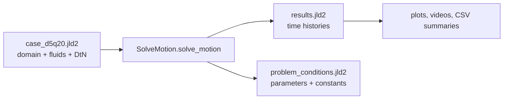

# Julia user guide

This folder contains a standalone Julia implementation of the kinematic-match droplet-on-bath solver. It does not call MATLAB at runtime.

The Julia version is the easiest entry point if you want to run small cases, script sweeps, or postprocess results without using the original MATLAB folder tree.

## What you need to know first

- Units are CGS: cm, g, s.
- The main entry point is `SolveMotion.solve_motion`.
- Inputs are loaded from a `.jld2` case file, not from nested MATLAB folders.
- Outputs are `.jld2` files containing named arrays and dictionaries.
- The bundled case file is small: `julia/data/case_d5q20.jld2`.



## One-time setup

Open a Julia session from the repository root:

```bash
julia
```

Then run this inside Julia:

```julia
import Pkg
Pkg.activate("julia")
Pkg.instantiate()
```

After this finishes, exit Julia or keep the session open.

## Run one simulation

From the repository root, start Julia with the project active:

```bash
julia --project=julia
```

Inside Julia:

```julia
include("julia/src/SolveMotion.jl")
SolveMotion.solve_motion(10.0, nothing, 10, 1e-2, nothing, false)
```

This means:

| Argument | Example | Meaning |
|---|---:|---|
| `U0` | `10.0` | impact speed in cm/s |
| second argument | `nothing` | kept for MATLAB API compatibility |
| `N` | `10` | number of droplet deformation modes |
| `tolP` | `1e-2` | pressure/deformation convergence tolerance |
| working directory | `nothing` | use default bundled case/output paths |
| debug flag | `false` | set `true` for verbose solver logging |

Default output folder:

```text
julia/output/
```

## Choose readable output names

The solver currently uses environment variables for output names. You do not need to set them in the shell; set them inside Julia before a run:

```julia
ENV["SOLVE_MOTION_OUTPUT_DIR"] = "julia/output/my_first_runs"
ENV["SOLVE_MOTION_OUTPUT_PREFIX"] = "U10_N10_tol1e-2_"

SolveMotion.solve_motion(10.0, nothing, 10, 1e-2, nothing, false)
```

To add a timestamp:

```julia
using Dates
ENV["SOLVE_MOTION_OUTPUT_PREFIX"] = "U10_" * Dates.format(now(), "yyyymmdd_HHMMSS") * "_"
```

This will produce files like:

```text
julia/output/my_first_runs/U10_20260522_101500_results.jld2
julia/output/my_first_runs/U10_20260522_101500_problem_conditions.jld2
```

## What is inside the output files?

The files are JLD2 containers. Think of them as named dictionaries saved to disk.

### `*_results.jld2`

This stores the time-dependent simulation output.

| Key | Meaning |
|---|---|
| `tvec` | saved simulation times |
| `z` | droplet center-of-mass height |
| `vz` | droplet center-of-mass velocity |
| `etaOri` | bath elevation at the origin/contact axis |
| `etas` | bath elevation field over the radial mesh and saved times |
| `numl` | accepted number of contact points at each saved time |
| `nlmax` | maximum geometrically allowed contact points at each saved time |
| `oscillation_amplitudes` | droplet deformation mode amplitudes |
| `pressure_amplitudes` | pressure expansion coefficients on the droplet |
| `Rv` | accepted contact/pressed radius history |

### `*_problem_conditions.jld2`

This stores run metadata and nondimensional parameters.

| Key | Meaning |
|---|---|
| `U0`, `N`, `Ang` | impact speed, number of modes, contact angle |
| `Re`, `Fr`, `We`, `WeS` | nondimensional groups used by the solver |
| `dtb`, `tend`, `nsteps` | base time step, final time, allocated step count |
| `L_unit`, `T_unit`, `M_unit` | dimensional scaling units |
| `PROBLEM_CONSTANTS` | solver constants passed through lower-level routines |
| `simul_time` | wall-clock runtime in seconds |

Inspect any output file from Julia:

```julia
using JLD2
results = load("julia/output/U10_N10_tol1e-2_results.jld2")
keys(results)
results["tvec"]
results["z"]
```

## Run a sweep and create a CSV summary

Use the helper script:

```julia
include("julia/scripts/sweep.jl")
```

By default it runs three impact speeds:

```julia
U0s = [5.0, 10.0, 15.0]
```

and writes:

```text
julia/output/*_results.jld2
julia/output/*_problem_conditions.jld2
julia/output/summary.csv
```

If you want to customize the sweep, open `julia/scripts/sweep.jl` and edit the final call to `run_sweep_and_summarize(...)`, for example:

```julia
run_sweep_and_summarize(; outdir="julia/output/sweep_U", U0s=[6.0, 8.0, 10.0], N=10, tolP=1e-2)
```

Then include the script again from Julia. The CSV summary currently records one row per `problem_conditions.jld2` file with the filename, `U0`, `N`, `tend`, and `simul_time`.

## Make a quick plot

This example plots droplet height versus time. It assumes you have installed a plotting package such as `Plots.jl`.

```julia
import Pkg
Pkg.add("Plots")   # one time only

using JLD2, Plots
r = load("julia/output/U10_N10_tol1e-2_results.jld2")
plot(r["tvec"], r["z"], xlabel="time", ylabel="z", label="COM height")
```

For videos, load `etas`, `z`, `Rv`, and the case mesh from the case file, then animate frames with your preferred plotting backend. The current Julia folder does not yet provide a polished video-making script.

## Precompile for faster first runs

Julia can spend noticeable time compiling functions the first time you run a case. To warm up the solver on a tiny run:

```julia
include("julia/scripts/precompile_small_case.jl")
```

For repeated development, run this once after package installation or after large code changes.

## Case files

The default case file is:

```text
julia/data/case_d5q20.jld2
```

It bundles:

- radial domain size and mesh spacing (`D`, `nr`, `dr`)
- bath operators (`Delta`, `IntMat`, `DTN`)
- bath and droplet physical parameters
- default radius and surface-tension/density parameters

You can load it directly:

```julia
include("julia/src/SolveMotion.jl")
case = SolveMotion.load_case("julia/data/case_d5q20.jld2")
```

## Build a new case file

Use this only when you need a new domain/resolution or physical parameter bundle.

```julia
include("julia/scripts/build_case.jl")
```

The generator reads configuration from environment variables. Defaults reproduce the bundled D5Q20-style case. Important options include:

```julia
ENV["CASE_D"] = "5"
ENV["CASE_QUANT"] = "20"
ENV["CASE_RHO"] = "1"
ENV["CASE_SIGMA"] = "72.2"
ENV["CASE_NU"] = "9.78e-3"
ENV["CASE_RO"] = "0.035"
ENV["CASE_OUTPUT"] = "julia/data/my_case.jld2"
```

Then run:

```julia
include("julia/scripts/build_case.jl")
```

The DtN matrix is expensive to compute. Prefer the bundled case unless you need a genuinely new domain.

## Source-file guide

```text
julia/src/SolveMotion.jl     module entry point
julia/src/solver.jl          main solve_motion time integrator
julia/src/solver_old.jl      retained baseline for refactor comparisons
julia/src/contact.jl         solveDD0 and solvenDDCusp contact solvers
julia/src/ode.jl             droplet deformation update
julia/src/projection.jl      pressure projection onto Legendre modes
julia/src/geometry.jl        spherical/cylindrical geometry helpers
julia/src/case.jl            case-file loading
julia/src/case_builder.jl    case-file construction
julia/src/dtn.jl             DtN generation utilities
```

## Regression checks

The exact refactor comparison runs the current solver against `solver_old.jl` on a small case:

```bash
julia --project=julia julia/tests/compare_refactor_exact.jl
```

A small MATLAB/Julia comparison helper also exists:

```bash
julia --project=julia julia/tests/compare_small_case.jl
```

That second check requires MATLAB to be callable from the same environment that launched Julia.

## Troubleshooting

### `Package JLD2 not found`

Activate and instantiate the Julia project:

```julia
import Pkg
Pkg.activate("julia")
Pkg.instantiate()
```

Or start Julia with:

```bash
julia --project=julia
```

### Output files overwrite each other

Set a unique prefix before each run:

```julia
using Dates
ENV["SOLVE_MOTION_OUTPUT_PREFIX"] = "U10_" * Dates.format(now(), "yyyymmdd_HHMMSS") * "_"
```

### First run is slow

Run the precompile helper once:

```julia
include("julia/scripts/precompile_small_case.jl")
```

### MATLAB exists in Terminal but Julia cannot spawn it

VS Code and GUI-launched apps sometimes inherit a different `PATH` than your terminal. Start VS Code from the terminal, or launch Julia from the same terminal where `matlab -h` works.

## Current limitations

- The Julia folder focuses on running and saving simulations; polished figure/video reproduction is still mostly in MATLAB.
- The default output names are generic unless you set `SOLVE_MOTION_OUTPUT_PREFIX`.
- Large cases are computationally expensive; start with D5Q20, `N=10`, and loose tolerances before scaling up.
